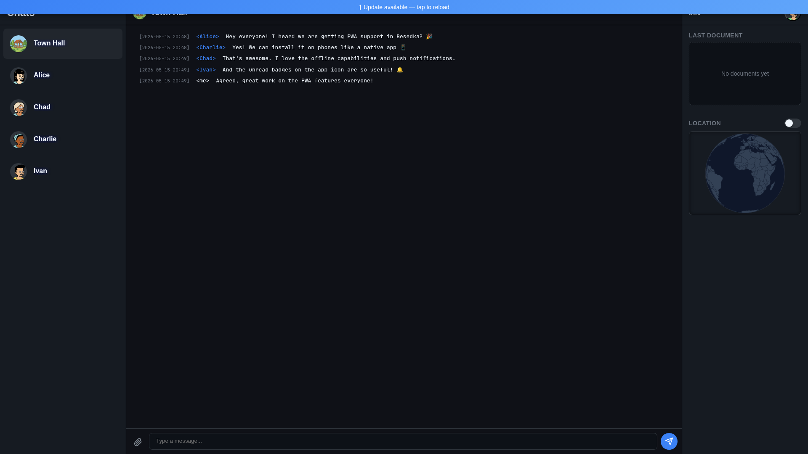

# Besedka

[](https://github.com/C-Pro/besedka/actions/workflows/pipeline.yml)

Besedka is a self-hosted chat application for a limited number of users (e.g. for a family or a small group of friends) built with Go and vanilla web technologies.



It is a fully installable Progressive Web App (PWA) that provides a native-like experience on both Mobile and Desktop devices, including support for Push Notifications.

It is designed to be self-sufficient without any hard dependencies on external services. All CSS and JS is self hosted, no 3rd party APIs or CDNs are used. It does not require nor support authentication with external OAuth providers (login with Google, Apple, etc.).
It does not track you or share your data with anyone.
## 🚧 Work in Progress

**Note:** This project is currently under active development with heavy use of AI (Google Antigravity).

## Tech Stack

- **Backend**: Go
- **Frontend**: HTML5, CSS3, Vanilla JavaScript
- **Protocol**: JSON over WebSocket

## Getting Started

### Docker

1. Create a directory for data:
   ```bash
   mkdir -p $(pwd)/data
   ```

2. Run the server:

```bash
docker run --name besedka -v $(pwd)/data:/data -e AUTH_SECRET=your-secret-key \
   -e BESEDKA_DB=/data/db -e ADMIN_ADDR=:8081 -p 8080:8080 -p 8081:8081 \
   ghcr.io/c-pro/besedka:latest
```

3. Access the Admin UI at [http://localhost:8081](http://localhost:8081) to manage users.
   - Default credentials: `admin` / `1337chat`

4. Create a user and follow the provided registration link to register (user will need TOTP app like Google Authenticator).
5. Chat is available at [http://localhost:8080](http://localhost:8080)


### Local development

To run locally from source:

1. Ensure you have Go installed (1.25+).
2. Start the server:
   ```bash
   AUTH_SECRET=your-secret-key go run main.go
   ```
3. Access the Admin UI at [http://localhost:8081](http://localhost:8081) to manage users.
   - Default credentials: `admin` / `1337chat`
4. Create a user and follow the provided registration link to register.
5. Chat is available at [http://localhost:8080](http://localhost:8080)

## Configuration

Besedka is configured entirely via environment variables.

| Variable | Description | Default |
| :--- | :--- | :--- |
| `AUTH_SECRET` | **(Required)** Secret key used for encrypting data and signing tokens. | |
| `CHAT_NAME` | Name of the chat application. | `Besedka` |
| `BESEDKA_DB` | Path to the bbolt database file. | `besedka.db` |
| `API_ADDR` | Address for the main chat server to listen on. | `:443` (if TLS enabled), else `:8080` |
| `ADMIN_ADDR` | Address for the Admin UI to listen on. | `localhost:8081` |
| `BASE_URL` | The public base URL of the application. | `http://localhost:8080` |
| `UPLOADS_PATH` | Directory where uploaded files and avatars are stored. | `uploads` |
| `ADMIN_USER` | Username for the Admin UI. | `admin` |
| `ADMIN_PASSWORD` | Password for the Admin UI. | `1337chat` |
| `TOKEN_EXPIRY` | Duration for which authentication tokens remain valid. | `24h` |
| `MAX_IMAGE_SIZE` | Maximum size for image uploads in bytes. | 10MB (`10485760`) |
| `MAX_AVATAR_SIZE` | Maximum size for avatar uploads in bytes. | 5MB (`5242880`) |
| `MAX_FILE_SIZE` | Maximum size for general file uploads in bytes. | 25MB (`26214400`) |
| `TLS_CERT` | Path to a custom TLS certificate file. | |
| `TLS_KEY` | Path to a custom TLS private key file. | |
| `TLS_AUTO_CERT_PATH` | Directory to cache Let's Encrypt certificates. Enables automatic Let's Encrypt integration. | |
| `ENABLE_HTTP_CHALLENGE` | Set to `true` to enable an HTTP-01 challenge server for Let's Encrypt. | `false` |
| `HTTP_CHALLENGE_PORT` | Port for the HTTP-01 challenge server to listen on. | `80` |
| `S3_ENDPOINT` | Endpoint URL of an S3-compatible object storage service. Set together with `S3_BUCKET` to enable backup & mirroring. | |
| `S3_BUCKET` | Bucket used for database backups and file mirroring. Set together with `S3_ENDPOINT` to enable the feature. | |
| `S3_REGION` | Region for the object storage service. | `us-east-1` |
| `S3_ACCESS_KEY` | Access key for the object storage service. | |
| `S3_SECRET_KEY` | Secret key for the object storage service. | |
| `S3_PATH_STYLE` | Use path-style addressing (`true` for MinIO/self-hosted; `false` for AWS virtual-host). | `true` |
| `S3_BACKUP_INTERVAL` | How often a **full** database backup is taken. | `24h` |
| `S3_BACKUP_INCREMENTAL_INTERVAL` | How often an **incremental** backup (changes since the previous backup) is taken. Must be shorter than `S3_BACKUP_INTERVAL`; `0` disables incrementals. | `15m` |
| `S3_BACKUP_KEEP` | Number of most-recent **full** backups to retain; each is pruned together with the incrementals that chain onto it. | `7` |

### Object storage (S3-compatible) backup & mirroring

Object storage is optional and disabled by default. Leave `S3_BUCKET` and
`S3_ENDPOINT` empty to keep it off. When both are set, Besedka:

- mirrors every uploaded file to the bucket,
- takes a full database backup on the `S3_BACKUP_INTERVAL` schedule (and via
  the `--backup` CLI command),
- takes an incremental backup — a small artifact holding only the records that
  changed since the previous backup — on the `S3_BACKUP_INCREMENTAL_INTERVAL`
  schedule and on shutdown (skipped when nothing changed since the last backup),
- recovers a missing database on startup from the newest full backup plus the
  incrementals taken after it, and
- fetches files from the bucket when they are missing locally.

Full backups are stored as `besedka-<timestamp>-full.bak`, incrementals as
`besedka-<timestamp>-incr.bak`; backups made by older versions
(`besedka-<timestamp>.bak`) are still recognized as full backups. During every
backup the database artifact is uploaded first and any not-yet-mirrored
attachment files after it, so messages are never less durable than the files
they reference. The backup prefix assumes a single server instance; if another
writer touches it, Besedka detects the divergence and falls back to a full
backup.

Backups and mirrored files are encrypted at rest using `AUTH_SECRET`, so it must
be set when object storage is enabled — startup fails otherwise. Access and
secret keys are required whenever the feature is enabled.

## CLI Commands

Besedka's binary doubles as an admin CLI. Passing any of the flags below runs a
single command against the **already-running** server's admin API and exits,
instead of starting the server.

Because these commands call the admin API over HTTP, the server must be running
and reachable at `ADMIN_ADDR`, and the same `ADMIN_USER` / `ADMIN_PASSWORD`
credentials are used for authentication. Run the command with the same
environment (at least `ADMIN_ADDR`, `ADMIN_USER`, `ADMIN_PASSWORD`) as the
server. `AUTH_SECRET` is not required for CLI commands.

| Command | Description |
| :--- | :--- |
| `--add-user <username>` | Create a user and print a registration setup link. |
| `--list-users` | List all users with their status (`created` / `active` / `deleted`) and online state. |
| `--delete-user <username>` | Delete a user. Prompts for confirmation unless `--yes` is also given. |
| `--reset-password <username>` | Reset a user's password and print a new setup link. |
| `--backup` | Trigger an out-of-schedule full backup **without** stopping the server. Requires S3 backup to be enabled. |
| `--shutdown` | Stop the primary chat server, take a final backup, then stop the process (see below). |

Users are identified by username for `--delete-user` and `--reset-password`; the
name is resolved to the matching non-deleted user server-side of the call.

Examples:

```bash
# Create a user
ADMIN_ADDR=localhost:8081 go run . --add-user alice

# List users
go run . --list-users

# Reset a password
go run . --reset-password alice

# Delete a user without the confirmation prompt (e.g. in scripts)
go run . --delete-user alice --yes

# Take an ad-hoc backup while the server keeps running
go run . --backup
```

### Graceful shutdown with backup

`--shutdown` is intended for migrating the service to another host without data
loss. It runs, in order:

1. Immediately stop the primary (chat) HTTP server so no further writes reach the
   database.
2. Take a final backup to object storage (only when S3 backup is enabled). The
   final backup is incremental whenever a healthy backup chain already exists —
   it uploads only the recent changes, fast enough to fit a cloud spot
   instance's termination grace period — and a full backup otherwise. Pending
   attachment uploads are flushed right after the database artifact.
3. Stop the process.

The command blocks until the backup completes, so a successful return guarantees
the final state was captured before exit. If the backup keeps failing after
retries, the process **exits with a non-zero code** (and the command reports the
error) instead of exiting cleanly — signalling that the shutdown was *not* safe
and the service should not be treated as migrated. When S3 backup is disabled,
`--shutdown` simply stops the process cleanly with no backup step.

A normal termination signal (`SIGTERM` / `SIGINT`, e.g. `Ctrl-C` or a container
stop) runs the **same** sequence: the primary server is stopped, a final backup
is taken (when S3 is enabled, with the same retries), and only then does the
process exit — with a non-zero code if that final backup fails.

## Encryption

Besedka supports at-rest encryption for the database and uploaded files. When `AUTH_SECRET` is provided, all sensitive data (users, messages, tokens, files) will be encrypted.

## Future Roadmap

- [x] Realtime updates for user presence/creation/deletion
- [x] User profile/settings
- [x] Password reset
- [x] User deletion
- [x] Admin UI
- [x] File attachments and media support
- [x] Infinite scrolling
- [x] Markdown formatting
- [ ] Emojis and reactions
- [x] Notifications
- [ ] Messages backup
- [x] TLS support
- [x] LetsEncrypt integration